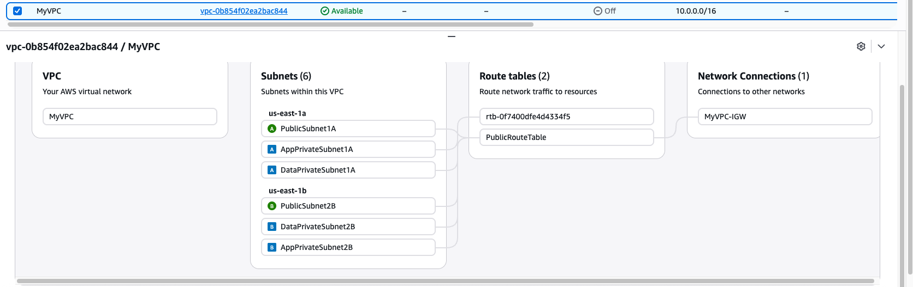
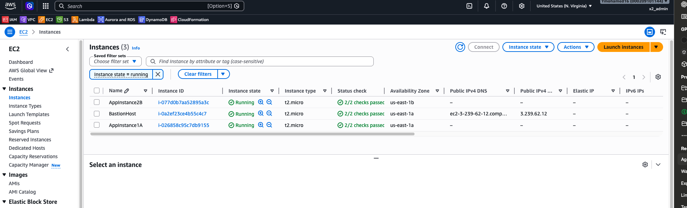
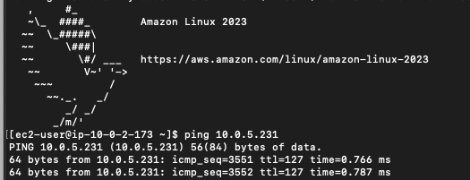

# AWS Multi-AZ VPC Infrastructure Lab

## Overview

This project deploys a multi-AZ AWS environment using CloudFormation.

The environment includes:

- Custom VPC
- Public and Private Subnets
- Internet Gateway
- Route Tables
- Bastion Host
- Private Application Servers
- Security Groups

All infrastructure is deployed using Infrastructure as Code (IaC) through AWS CloudFormation.

---

## Architecture

### VPC

CIDR Block:

10.0.0.0/16

### Availability Zone A

- PublicSubnet1A (10.0.1.0/24)
- AppPrivateSubnet1A (10.0.2.0/24)
- DataPrivateSubnet1A (10.0.3.0/24)

### Availability Zone B

- PublicSubnet2B (10.0.4.0/24)
- AppPrivateSubnet2B (10.0.5.0/24)
- DataPrivateSubnet2B (10.0.6.0/24)

---

## Networking

An Internet Gateway is attached to the VPC.

Public subnets are associated with a public route table containing:

0.0.0.0/0 → Internet Gateway

This allows internet access for resources placed in public subnets.

---

## Bastion Host

A Bastion Host is deployed inside PublicSubnet1A.

Purpose:

- Secure administrative access
- SSH entry point into the environment
- Access private resources without exposing them directly to the internet

SSH access is restricted to my public IP address through a Security Group.

---

## Application Instances

Two EC2 application servers are deployed:

- AppInstance1A
- AppInstance2B

Both reside in private subnets.

These instances do not have direct public internet access.

---

## Security Groups

### BastionHostSG

Allows:

- TCP 22 (SSH)
- Source: My public IP

### AppInstance1ASG

Allows:

- TCP 22 (SSH)
- Source: BastionHostSG

### AppInstance2BSG

Allows:

- ICMP (Ping)
- Source: AppInstance1ASG

---

## Validation Performed

### SSH Validation

Successfully connected:

Laptop → Bastion Host

Successfully connected:

Bastion Host → AppInstance1A

### Network Validation

Successfully tested ICMP connectivity:

AppInstance1A → AppInstance2B

Results:

- 5 packets transmitted
- 5 packets received
- 0% packet loss

This verified:

- VPC routing
- Subnet communication
- Security Group configuration
- Private network connectivity

---

## Key Lessons Learned

- Infrastructure can be deployed using CloudFormation instead of manual console configuration.
- Security Groups control traffic based on protocol, source, and destination.
- Bastion Hosts provide secure access to private infrastructure.
- Successful routing does not guarantee successful connectivity; Security Groups must also permit traffic.
- ICMP and SSH require separate Security Group rules.

---

## Technologies Used

- AWS CloudFormation
- Amazon VPC
- Amazon EC2
- Security Groups
- Internet Gateway
- Route Tables
- SSH
- Git
- GitHub

## Architecture

## Bastion Host

## Connectivity Validation

